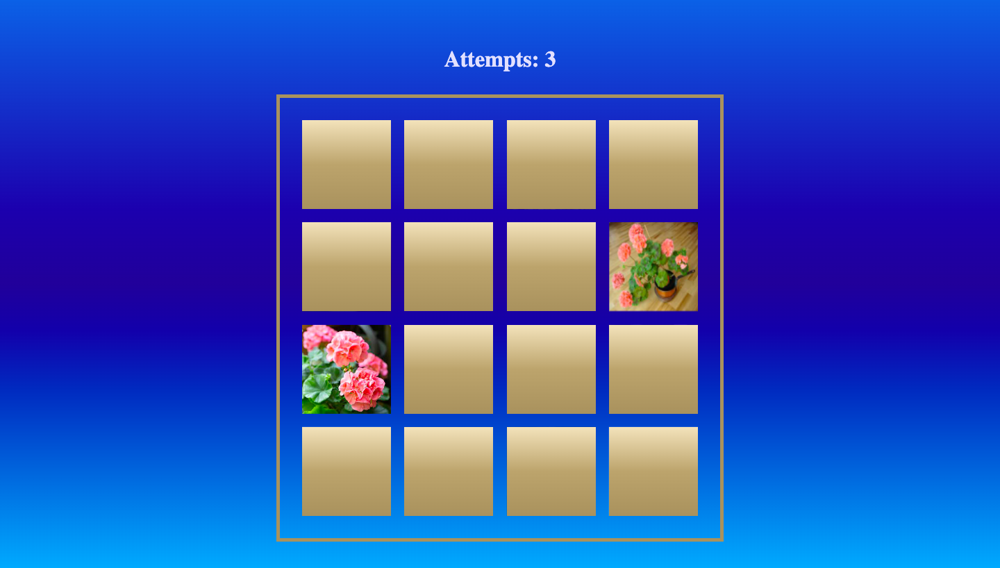

# Memory Game

[Link to published site](https://annaaxelsson051.github.io/Memory-Game/)

## User Interface

---

## Description 

Uplifting memory game with flipping cards with flowers. All cards are initially turned upside down, the user clicks two cards that then flips, displaying their images, and then flips back again hiding the image - the goal is to find all pairs of images. The user continues to flip two cards at a time and wins the game if all matching image pairs are found on six attempts.

---

## Technologies used

- Vanilla JavaScript
- HTML
- CSS

